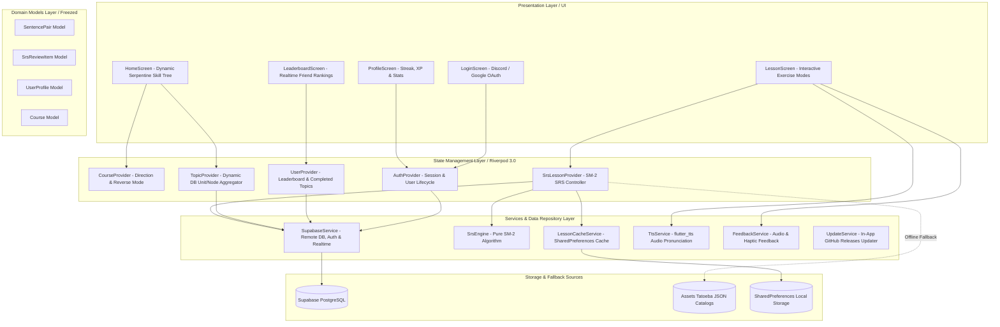

# Limpede — Architecture & Technical Specification ⚡💧

This document provides a comprehensive overview of the architecture, tech stack, data flow, and implemented features for the **Limpede** application.

> [!IMPORTANT]
> **Living Document Protocol**: Any AI agent or developer modifying the architecture, dependencies, data models, or core features **MUST** keep this document synchronized and updated alongside [`RELEASE_NOTES.md`](RELEASE_NOTES.md) and [`README.md`](README.md).

---

## 1. 🏛️ Architectural Overview & Design Philosophy

Limpede is a gamified, mobile-first language learning application engineered with a **100% deterministic, offline-resilient architecture**.



### Core Architectural Pillars:
1. **Deterministic-First (Zero AI Hallucinations)**: Core lesson paths, grammar exercises, and spaced repetition queues are driven strictly by deterministic database records, semantic clustering, and pure mathematical algorithms (SM-2).
2. **Offline-First Resilience**: If the user is offline or the Supabase backend is unreachable, the application seamlessly falls back to local SharedPreferences caches and curated Tatoeba JSON catalogs without crashing or blocking navigation.
3. **Zero Data Duplication (Virtual Reverse Decks)**: Enables bi-directional language learning (e.g. `Romanian ➔ English` vs. `English ➔ Romanian`) using a single set of database records through runtime virtual swapping.
4. **Decoupled Separation of Concerns**: UI components never make direct database queries or side-effect calls; all interactions route through Riverpod Notifiers and injectable Service classes.

---

## 2. 🛠️ Technology Stack & Dependencies

### Core Framework & Runtime
- **Framework:** Flutter SDK `3.32.8` (Dart SDK `3.8.1` / `<4.0.0`)
- **Target Platforms:** Android (APK / Android 7.0+ `minSdkVersion 24`, `compileSdk 36`, `ndkVersion 27.0.12077973`), Web

### State Management & Architecture
- **State Management:** Riverpod 3.0 (`flutter_riverpod: ^2.5.1`, `riverpod_annotation: ^2.3.5`, `riverpod_generator: ^2.4.0`)
- **Data Modeling & Immutability:** Freezed (`freezed: ^2.4.7`, `freezed_annotation: ^2.4.4`) with JSON Serialization (`json_serializable: ^6.7.1`, `json_annotation: ^4.8.1`)
- **Environment & Secrets:** Envied (`envied: ^1.0.0`, `envied_generator: ^1.0.0`)

### Backend, Database & Authentication
- **BaaS Platform:** Supabase (`supabase_flutter: ^2.3.4`)
- **Authentication Providers:** Google Sign-In (`google_sign_in: ^6.2.1`), Discord OAuth, Anonymous / Guest Mode fallback
- **Realtime Sync:** Supabase Realtime Channels for live leaderboard updates

### Audio, TTS & UI
- **Routing:** GoRouter (`go_router: ^14.0.0`)
- **Text-to-Speech (TTS):** `flutter_tts: ^4.0.0`
- **Sound Effects:** `audioplayers: ^6.0.0`
- **Local Persistence:** `shared_preferences: ^2.2.0`
- **App Launcher Icons:** `flutter_launcher_icons: ^0.13.1`
- **UI Design System:** Material 3 with custom dynamic serpentine path rendering, dark mode, and tactile haptic/audio feedback

### CI / CD & Automation
- **CI/CD Platform:** GitHub Actions (`.github/workflows/release.yml`)
- **Automated Versioning:** Tag-triggered (`v*`) compilation of `app-release.apk` with automatic GitHub Releases publishing
- **In-App Auto-Updater:** `UpdateService` parsing GitHub Releases API for semantic version bumps

---

## 3. 📂 Codebase Directory Structure

```
limpede/
├── .github/
│   └── workflows/
│       └── release.yml            # Automated APK release & GitHub Release workflow
├── android/                       # Native Android configuration (SDK 36, NDK 27, MinSDK 24)
├── assets/
│   ├── audio/                     # Sound effects (correct, incorrect, level up)
│   ├── icon/                      # Application icons
│   ├── supabase_schema.sql        # Database schema, RLS policies, indexes, and initial seeds
│   └── tatoeba_*_catalog.json     # Offline Tatoeba sentence catalogs (DE, ES, FR, IT, JA, PT, RO, RU, TR)
├── lib/
│   ├── main.dart                  # Application entrypoint & Supabase initialization
│   ├── router.dart                # GoRouter route declarations & auth redirect guard
│   ├── models/                    # Freezed data models (Course, SentencePair, SrsReviewItem, UserProfile)
│   ├── providers/                 # Riverpod controllers & state notifiers
│   │   ├── auth_provider.dart     # Auth session, OAuth login, and lesson completion XP
│   │   ├── course_provider.dart   # Native/Target language selection & reverse mode logic
│   │   ├── feedback_provider.dart # Audio & haptic feedback controller
│   │   ├── lesson_provider.dart   # TTS & Lesson cache providers
│   │   ├── mistake_provider.dart  # Mistake backlog tracking
│   │   ├── settings_provider.dart # Theme mode & app preferences
│   │   ├── srs_lesson_provider.dart # Lesson deck loader, exercise queue, and SM-2 scoring
│   │   ├── topic_provider.dart    # Skill tree dynamic unit grouping from Supabase
│   │   └── user_provider.dart     # Leaderboard & completed topic tracking
│   ├── screens/                   # Top-level screen views
│   │   ├── home_screen.dart       # Dynamic serpentine skill tree, course selector, daily review card
│   │   ├── lesson_screen.dart     # Interactive exercise flow (MC, sentence builder, matching pairs)
│   │   ├── leaderboard_screen.dart# Realtime user rankings and XP podium
│   │   ├── login_screen.dart      # OAuth sign-in & branding
│   │   └── profile_screen.dart    # User progress, streak, total XP, and stats
│   ├── services/                  # Business logic services & data connectors
│   │   ├── env_service.dart       # Envied compile-time environment configuration
│   │   ├── feedback_service.dart  # Audio & vibration player
│   │   ├── lesson_cache_service.dart # Local caching of lesson decks
│   │   ├── srs_engine.dart        # Pure SuperMemo-2 (SM-2) algorithm implementation
│   │   ├── supabase_service.dart  # Database CRUD, RLS queries, and auth connectors
│   │   ├── tts_service.dart       # Multi-language text-to-speech speaker
│   │   └── update_service.dart    # GitHub release update checker
│   ├── utils/                     # Helpers & localization dictionaries
│   │   ├── language_utils.dart    # Language code normalizer, fallback decks, and distractors
│   │   ├── localized_strings.dart # UI string localizations across 9 languages
│   │   └── topic_translator.dart  # Unit, node, and subtitle topic translation dictionaries
│   └── widgets/                   # Modular, reusable UI components
│       ├── animated_progress_bar.dart # Lesson step progress bar
│       ├── custom_lesson_button.dart  # Styled action button
│       ├── matching_pairs_widget.dart # Vocabulary tap-to-match interactive exercise
│       ├── sentence_builder_widget.dart # Word-tile rearrangement interactive exercise
│       └── skill_tree_node.dart   # Gamified circular node with status rings & icons
├── test/                          # Automated unit and widget tests
│   ├── srs_engine_test.dart       # SM-2 math & interval progression verification
│   └── widget_test.dart           # Model serialization & deserialization tests
├── ARCHITECTURE.md                # Master system architecture & technical specification
├── RELEASE_NOTES.md               # Version-by-version changelog & release history
├── README.md                      # Project overview & developer setup instructions
└── agents.md                      # AI agent workflow constraints & development protocols
```

---

## 4. ⚡ Comprehensive Features Implemented

### 1. SuperMemo-2 (SM-2) Spaced Repetition Engine
- **Algorithmic Grading ($0 - 5$ Scale)**:
  - $0$: Complete blackout.
  - $1$: Incorrect response; correct one remembered upon display.
  - $2$: Incorrect response; correct one seemed easy to recall.
  - $3$: Correct response recalled with serious difficulty.
  - $4$: Correct response after hesitation.
  - $5$: Perfect recall with zero hesitation.
- **Interval Progression ($I$)**:
  $$I(1) = 1 \text{ day}, \quad I(2) = 6 \text{ days}, \quad I(n) = I(n-1) \times EF$$
- **Dynamic Ease Factor ($EF$) Calculation**:
  $$EF' = EF + (0.1 - (5 - \text{grade}) \times (0.08 + (5 - \text{grade}) \times 0.02))$$
  *(Guaranteed minimum $EF \ge 1.3$ to prevent review freeze).*
- **Failure Reset**: An incorrect answer (Grade $< 3$) resets consecutive repetitions to $0$ and interval to $1$ day.

### 2. Dynamic Supabase Skill Tree (Duolingo-Style Serpentine Path)
- **Automatic Aggregation**: Dynamically queries distinct `topic_category` strings from Supabase (e.g. `"Basics: Saying hello and goodbye"`), splitting them into structured Units (*Basics, Food, Travel, Family & Home, Education, Work, Shopping, Health*).
- **Mathematical Serpentine Path**: Generates alternating sinusoidal offsets (`[0.0, -45.0, -25.0, 25.0, 45.0, 20.0, -35.0]`) to create an authentic zigzag learning trail.
- **Node Progression States**: Nodes dynamically reflect `locked`, `available`, `in-progress`, and `completed` states with star badges, contextual Material 3 icons, and pulsing active rings.

### 3. Virtual Reverse Decks (Zero Data Duplication)
- **Bidirectional Course Selection**: Users can choose their `NativeLanguage` and `TargetLanguage` (e.g., `Română ➔ English` or `Français ➔ English`).
- **Runtime Swapping Engine**:
  - Automatically identifies `isReverseMode == true` when non-English speakers learn English.
  - Queries `language_code = nativeLanguageCode` from Supabase without needing duplicate reverse rows in PostgreSQL.
  - Dynamically swaps prompt question ($\leftrightarrow$) target answer and draws distractor options from English sentence pools.

### 4. Full Localization Across 9 Languages
- **Supported Locales**: English (`en`), Romanian (`ro`), French (`fr`), German (`de`), Spanish (`es`), Italian (`it`), Portuguese (`pt`), Russian (`ru`), Japanese (`ja`).
- **Dynamic UI Prompts** ([`localized_strings.dart`](lib/utils/localized_strings.dart)): Contextual headers (e.g., *"Translate into German:"* $\rightarrow$ *"Traduceți în germană:"* $\rightarrow$ *"Traduisez en allemand : "*), action buttons, and review prompts.
- **Dynamic Unit & Node Dictionaries** ([`topic_translator.dart`](lib/utils/topic_translator.dart)): Visual node titles and unit headers translate into the user's native language on the frontend while strictly passing original raw English keys to the backend for 100% database query integrity.

### 5. Multi-Modal Interactive Exercises
- **Multiple Choice Questions**: Dynamically generated 4-option questions with authentic distractors pulled from active sentence decks.
- **Sentence Builder Drill** ([`sentence_builder_widget.dart`](lib/widgets/sentence_builder_widget.dart)): Interactive tap-to-assemble word tile banks with slotting animation.
- **Matching Pairs Drill** ([`matching_pairs_widget.dart`](lib/widgets/matching_pairs_widget.dart)): Two-column vocabulary tap-to-match exercises with instant color-coded matching states.
- **Native Pronunciation (TTS)** ([`tts_service.dart`](lib/services/tts_service.dart)): Audio speech pronunciation for target sentences across Spanish, French, German, Japanese, and English.

### 6. Offline Resilience & Multi-Tier Fallbacks
- **Tier 1 (Remote Supabase)**: Realtime PostgreSQL query for active sentence pairs and user SRS backlog.
- **Tier 2 (Local SharedPreferences Cache)**: Cached decks loaded instantly on app restart.
- **Tier 3 (Local JSON Catalogs)**: Extensive offline Tatoeba sentence libraries in `assets/tatoeba_*_catalog.json`.
- **Tier 4 (Hardcoded A1/A2 Practice Decks)**: Pure static native fallback sentences in [`language_utils.dart`](lib/utils/language_utils.dart) ensuring zero blank screens or placeholder strings.

### 7. Gamification, Social Leaderboards & User Profiles
- **XP Progression & Hearts System**: Users start lessons with 5 hearts, lose 1 per mistake, and earn 25+ XP on completion.
- **Daily Streak Counter**: Streak calculations with timestamps stored locally and synced remotely.
- **Supabase Realtime Leaderboard**: Live friend leaderboard ranked by total XP with podium avatars and rank badges.

### 8. Automated CI/CD & In-App Auto-Update
- **GitHub Actions Release Pipeline**: On pushing tags matching `v*`, CI automatically runs tests, builds `app-release.apk`, and creates a GitHub Release.
- **In-App Updater** ([`update_service.dart`](lib/services/update_service.dart)): Automatically queries GitHub's latest release API on app launch and presents a one-tap download prompt if a new version is available.

---

## 5. 🗄️ Database Schema & Storage Model

```sql
-- Core Table: sentence_pairs
CREATE TABLE IF NOT EXISTS public.sentence_pairs (
    id TEXT PRIMARY KEY,
    source_text TEXT NOT NULL,
    target_text TEXT NOT NULL,
    language_code TEXT NOT NULL,       -- 'es', 'fr', 'de', 'ja', 'it', 'pt', 'ro', 'ru', 'tr'
    difficulty_level TEXT NOT NULL,    -- 'A1', 'A2', 'B1', 'B2', 'C1'
    topic_category TEXT NOT NULL,      -- e.g. 'Basics: Saying hello and goodbye'
    created_at TIMESTAMPTZ DEFAULT NOW()
);

-- Core Table: srs_review_items
CREATE TABLE IF NOT EXISTS public.srs_review_items (
    id TEXT PRIMARY KEY,
    user_id UUID REFERENCES auth.users(id) ON DELETE CASCADE,
    sentence_pair_id TEXT REFERENCES public.sentence_pairs(id) ON DELETE CASCADE,
    ease_factor FLOAT DEFAULT 2.5,
    interval_days INT DEFAULT 0,
    repetitions INT DEFAULT 0,
    next_review_date TIMESTAMPTZ DEFAULT NOW(),
    last_reviewed_at TIMESTAMPTZ,
    UNIQUE(user_id, sentence_pair_id)
);

-- User Profiles & Gamification
CREATE TABLE IF NOT EXISTS public.user_profiles (
    id UUID PRIMARY KEY REFERENCES auth.users(id) ON DELETE CASCADE,
    username TEXT,
    avatar_url TEXT,
    xp INT DEFAULT 0,
    streak INT DEFAULT 0,
    last_active_at TIMESTAMPTZ DEFAULT NOW()
);

-- Lesson Completion Logs
CREATE TABLE IF NOT EXISTS public.completed_lessons (
    id UUID PRIMARY KEY DEFAULT gen_random_uuid(),
    user_id UUID REFERENCES auth.users(id) ON DELETE CASCADE,
    topic TEXT NOT NULL,
    completed_at TIMESTAMPTZ DEFAULT NOW()
);
```

---

## 6. 📋 Protocols for AI Agents & Developers

When contributing to this repository:
1. **Never Re-introduce External LLM/AI APIs in Core Gameplay**: Core paths must remain 100% deterministic, low-latency, and offline-resilient.
2. **Strict File Size & Modularity**: Keep widget and provider files modular and under 300 lines. Extract reusable components into `lib/widgets/`.
3. **Mandatory Documentation Synchronization**:
   - Update [`ARCHITECTURE.md`](ARCHITECTURE.md) whenever architecture, models, or features change.
   - Update [`RELEASE_NOTES.md`](RELEASE_NOTES.md) under a new or active version section.
   - Update [`README.md`](README.md) if installation, prerequisites, or high-level features change.
4. **Semantic Versioning & CI Verification**:
   - Ensure `flutter analyze` reports **0 issues** and `flutter test` reports **all tests passed** before creating release tags.
